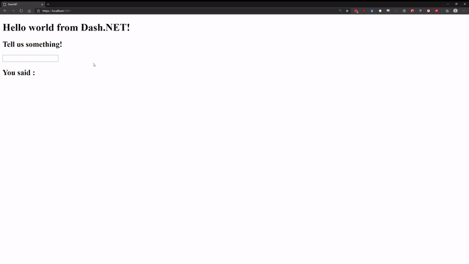

# Dash.NET

Dash.NET is a .NET interface to [Dash](https://plotly.com/dash/) - the most downloaded framework for building ML &amp; data science web apps - written in F#. Built on top of Plotly.js, React and asp.netcore (via Giraffe), Dash.NET ties modern UI elements like dropdowns, sliders, and graphs directly to your analytical .NET code.

This library is under heavy development. Things might break. However, Dash.NET has a stable core and has already been used for [non trivial applications](https://github.com/CSBiology/TMEA). The current development goal is to implement all targets set in the [beta roadmap](https://github.com/plotly/Dash.NET/issues/4), where you can also see a summary of the state of the project.

## Usage

You can either use the [Dash.NET template](https://github.com/plotly/Dash.NET.Template) via the `dotnet new` templating engine to start from a new template dash application, or add Dash.NET to your existing project via our [preview nuget package](https://www.nuget.org/packages/Dash.NET)

In Dash.NET, everything is basically about constructing a `DashApp` that holds all parts of your dash application, such as:
-  the `Layout`, which holds the UI components of your application
- `Callbacks` that handle how different components in your `Layout` interact with each other
- Various server and renderer configurations via `DashConfig`
- The `IndexView` template that controls the html scaffold that holds the rendered application.

The most simple (and boring) Dash.NET application looks like this:

```F#
open Dash.NET

let myApp = DashApp.initDefault()
```

Which creates a `DashApp` with all fields initialized with empty defaults. The http handler for a `DashApp` can be accessed via the `DashApp.toHttpHandler` function to plug it into your aps.netcore application configuration function via `UseGiraffe` (for more info, check out Giraffe docs or take a look at the [dev project in this repo](https://github.com/plotly/Dash.NET/blob/dev/dev/Program.fs#L104))

### Basic application

To get actual content into the default application, it needs a `Layout`. `Layout`s can be created via Dash.NET's DSL for html components, where the first function parameter is always a list of properties (e.g. for setting css classes), and the second a list of children.

```F#
open Dash.NET.HTML

//Will create the following html:
//<div>
//  <h1>"Hello world from Dash.NET!"</h1>
//</div>
//
let myLayout = 
    Div.div [] [
        H1.h1 [] [str "Hello world from Dash.NET!"]
    ]
let test = 
    DashApp.initDefault()
    |> DashApp.withLayout myLayout
```


---

<br>

You can also use most dash core components. The following example uses the Plotly.NET to create a plotly graph component. Note that all core components must have a nunique id, and therefore have the mandatory id parameter:

```F#
open Dash.NET.HTML
open Dash.NET.DCC
open Plotly.NET

let myGraph = Chart.Line([(1,1);(2,2)])

let myLayout = 
    Div.div [] [
        H1.h1 [] [str "Hello world from Dash.NET!"]
        H2.h2 [] [str "Take a look at this graph:"]
        Graph.graph "my-ghraph-id" [Graph.Figure (myGraph |> GenericChart.toFigure)] []
    ]
let test = 
    DashApp.initDefault()
    |> DashApp.withLayout myLayout
```


---

<br>

### Basic callback

Callbacks describe the interactive part of your `DashApp`. In the most basic case, you have one input component, which updates one output component. For both you need to assign the property of the component that will be part of the callback. Additionally, a function is needed that takes the input and returns the output:

```F#
open Dash.NET.HTML
open HTMLPropTypes
open Dash.NET.DCC
open ComponentPropTypes

let myLayout = 
    Div.div [] [
        H1.h1 [] [str "Hello world from Dash.NET!"]
        H2.h2 [] [str "Tell us something!"]
        Input.input "test-input" [Input.Type InputType.Text] []
        H2.h2 [Id "test-output"] []
    ]

let testCallback =
    Callback(
        [CallbackInput.create("test-input","value")],       // <- Input of the callback is the `value` property of the component with the id "test-input"
        CallbackOutput.create("test-output","children"),    // <- Output of the callback is the `children` property of the component with the id "test-output"
        
        (fun (input:string) ->                              // this function takes a string as input and returns another message.
            sprintf "You said : %s" input
        )
    )

let test = 
    DashApp.initDefault()
    |> DashApp.withLayout myLayout
    |> DashApp.addCallback testCallback
```

Note that it is currently necessary to provide the component properties in string form. You will have to take care of the correct amount and types of the callback function parameters. Binding a function with two parameters to above example would cause a runtime error.



## Development

To build the project and dev server application, run the `fake.cmd` script in order to restore and build 

##### Windows
```
> ./fake.cmd build
```

##### Linux/MacOS
```
$ ./fake.sh build
```

## Run the dev server application

The dev server is useful to test new components/code. After a successful build 
you can start the dev server application by executing the following command in your terminal:

```
dotnet run -p ./dev/Dash.NET.Dev.fsproj
```

After the application has started visit [https://localhost:5001/](https://localhost:5001/) or [http://localhost:5000/](http://localhost:5000/) in your preferred browser.