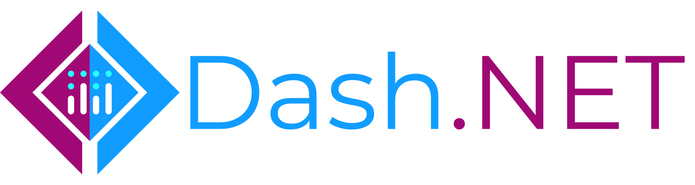
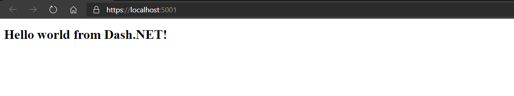
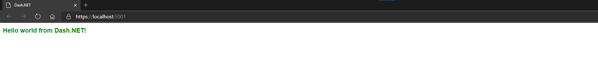
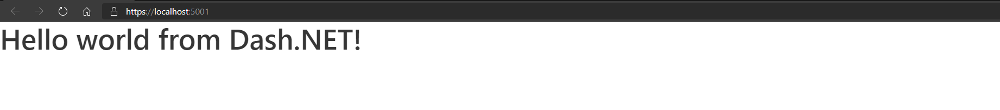
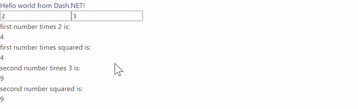
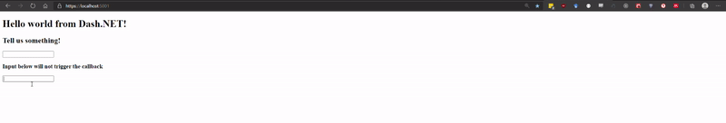

# Dash.NET



Dash.NET is a .NET interface to [Dash](https://plotly.com/dash/) - the most downloaded framework for building ML &amp; data science web apps - written in F#. Built on top of Plotly.js, React and asp.netcore (via Giraffe), Dash.NET ties modern UI elements like dropdowns, sliders, and graphs directly to your analytical .NET code.

This library is under heavy development. Things might break. However, Dash.NET has a stable core and has already been used for non trivial applications ([example1](https://github.com/CSBiology/TMEA), [example2](https://github.com/TRR175/ExploreKinetics)). The current development goal is to implement all targets set in the [beta roadmap](https://github.com/plotly/Dash.NET/issues/4), where you can also see a summary of the state of the project.

The documentation is WIP as well.

# Table of contents

<!-- TOC -->

- [Installation](#installation)
- [Usage](#usage)
    - [Basic application](#basic-application)
    - [Referencing content](#referencing-content)
    - [Dash Core components (DCC)](#dash-core-components-dcc)
    - [callbacks](#callbacks)
        - [single output](#single-output)
        - [using Dash.NET operators](#using-dashnet-operators)
        - [multiple outputs](#multiple-outputs)
        - [Recommendations for callbacks (especially multi output callbacks)](#recommendations-for-callbacks-especially-multi-output-callbacks)
    - [Using state](#using-state)
    - [build](#build)
    - [docs](#docs)
    - [Run the dev server application](#run-the-dev-server-application)

<!-- /TOC -->

## Installation

Get the latest preview package via nuget: [](https://www.nuget.org/packages/Dash.NET/)

Use the `dotnet new` template: 

`dotnet new -i Dash.NET.Template::*` 

(watch out, this template might not use the latest Dash.NET package, take a look at the referenced version and update if needed )


## Usage

In Dash.NET, everything is basically about constructing a `DashApp` that holds all parts of your dash application, such as:
-  the `Layout`, which holds the UI components of your application
- `Callbacks` that handle how different components in your `Layout` interact with each other
- Various server and renderer configurations via `DashConfig`
- The `IndexView` template that controls the html scaffold that holds the rendered application.

The most simple (and boring) Dash.NET application looks like this:

```fsharp
open Dash.NET

let myApp = DashApp.initDefault()
```

Which creates a `DashApp` with all fields initialized with empty defaults. The http handler for a `DashApp` can be accessed via the `DashApp.toHttpHandler` function to plug it into your aps.netcore application configuration function via `UseGiraffe` (for more info, check out Giraffe docs or take a look at the [dev project in this repo](https://github.com/plotly/Dash.NET/blob/dev/dev/Program.fs#L104))

### Basic application

To get actual content into the default application, it needs a `Layout`. `Layout`s can be created via Dash.NET's DSL for html components, where the first function parameter is always a list of properties (e.g. for setting css classes), and the second a list of children.

```fsharp
open Dash.NET.HTML

//Will create the following html:
//<div>
//  <h1>"Hello world from Dash.NET!"</h1>
//</div>
//
let myLayout = 
    Div.div [] [
        H1.h1 [] [str "Hello world from Dash.NET!"]
    ]
let test = 
    DashApp.initDefault()
    |> DashApp.withLayout myLayout
```



---

<br>

### Referencing content

You can include internal and external stylesheets and scripts via `DashApp.appendCSSLinks` and `DashApp.appendScripts`:

Let's say you have the following `main.css` file in your wwwroot directory (served from `/main.css`)

```CSS
h1 {
    font-size: 1.5em;
    color: green;
}
```

you can reference it from your `DashApp` like this (using the basic example from above):

```fsharp
let test = 
    DashApp.initDefault()
    |> DashApp.withLayout myLayout
    |> DashApp.appendCSSLinks ["main.css"]

```



---

If you want to reference external content (e.g. a CSS framework like [Bulma](https://bulma.io/)), you can do that as well. To use the classes defined there, set the `ClassName` accordingly:

```fsharp
let myLayout = 
    Div.div [] [
        H1.h1 [ClassName "title is-1"] [str "Hello world from Dash.NET!"]
    ]


let test = 
    DashApp.initDefault()
    |> DashApp.withLayout myLayout
    |> DashApp.appendCSSLinks [
        "https://cdnjs.cloudflare.com/ajax/libs/bulma/0.9.1/css/bulma.min.css"
    ]
```



---

### Dash Core components (DCC)

You can also use most dash core components. The following example uses the Plotly.NET to create a plotly graph component. Note that all core components must have a nunique id, and therefore have the mandatory id parameter:

```fsharp
open Dash.NET.HTML
open Dash.NET.DCC
open Plotly.NET

let myGraph = Chart.Line([(1,1);(2,2)])

let myLayout = 
    Div.div [] [
        H1.h1 [] [str "Hello world from Dash.NET!"]
        H2.h2 [] [str "Take a look at this graph:"]
        Graph.graph "my-ghraph-id" [Graph.Figure (myGraph |> GenericChart.toFigure)] []
    ]
let test = 
    DashApp.initDefault()
    |> DashApp.withLayout myLayout
```


---

<br>

### callbacks

Callbacks describe the interactive part of your `DashApp`. 

#### single output

Callbacks with single outputs describe either a (1 -> 1) or (n -> 1) dependency between components.

In the most basic case, you have one input component, which updates one output component (1 -> 1). For both you need to assign the property of the component that will be part of the callback. Additionally, a function is needed that takes the input and returns the output. Lets first define the layout for this example:

```fsharp
open Dash.NET.HTML
open HTMLPropTypes
open Dash.NET.DCC
open ComponentPropTypes

let myLayout = 
    Div.div [] [
        H1.h1 [] [str "Hello world from Dash.NET!"]
        H2.h2 [] [str "Tell us something!"]
        Input.input "test-input" [Input.Type InputType.Text] []
        H2.h2 [Id "test-output"] []
    ]
```

There are multiple ways of defining callbacks, all of which use the respective `DashApp.singleOut` overloads for (1 -> 1), as well as (1 -> n) callbacks. 

The most simple (1 -> 1) callback needs:
- 1 `CallbackInput`, which is a representation of the input component and the property that triggers the callback
- 1 `CallbackOutput`, which is a representation of the output component and the property that will be updated by the callback
- A function taking as many inputs as there are input components (1 in this case) that creates the callback output

```fsharp
// a 1 -> 1 callback
let testCallback =
    Callback.singleOut(
        CallbackInput.create("test-input","value")],       // <- Input of the callback is the `value` property of the component with the id "test-input"
        CallbackOutput.create("test-output","children"),    // <- Output of the callback is the `children` property of the component with the id "test-output"
        (fun (input:string) ->                              // this function takes a string as input and returns another message.
            sprintf "You said : %s" input
        )
    )
```


#### using Dash.NET operators

While above usage of callbacks is the most similar to the original python library, we can leverage the type System of F# to make those calls a little bit safer.

To simplify the generation of `CallbackInput` and `CallbackOutput`, as well as making sure you are updating the right property in the callback handler function, you can use the custom operators provided by Dash.NET:

- `@.` defines `CallbackInput` or `CallbackOutput` (as well as `CallbackState`, more on that later) in a typesafe way, so you don't need to write the properties in string from anymore.

- `=>` defines a `CallbackResultBinding`, which is the representation of a function result bound to the given output property (this is more valuable when we come to multioutput callbacks later)

Here is the same simple callback using Dash.NET operators:

```fsharp
open Dash.NET.Operators

let testCallback =
    Callback.singleOut(
        "test-input" @. Value,       // <- Input of the callback is the `value`property of the component with the id "test-input", now typesafe
        "test-output" @. Children,    // <- Output of the callback is the `children` property of the component with the id "test-output", now typesafe
        (fun (input:string) ->                              // this function takes a string as input and returns another message, now bound to the output property
            "test-output" @. Children => sprintf "You said : %s" input
        )
    )

```

If you don't like operators, you can still make your callbacks safer using the type safe `create` overloads and `CallbackResultBinding.create`:

```fsharp
let testCallback =
    Callback.singleOut(
        CallbackInput.create("test-input" ,Value),       // <- Input of the callback is the `value` property of the component with the id "test-input"
        CallbackOutput.create("test-output", Children),    // <- Output of the callback is the `children` property of the component with the id "test-output"
        (fun (input:string) ->                              // this function takes a string as input and returns another message.
            CallbackResultBinding.bindResult 
                (CallbackOutput.create("test-output", Children))
                (sprintf "You said : %s" input)
        )
    )
```

#### multiple outputs

The following example shows how to define a (n -> n) multi output callback, again first with the most python-like way, and then in more type safe .NET manner.

let's first define the layout used in this example:

```fsharp
let testLayout =

    Div.div [] [
        H1.h1 [] [str "Hello world from Dash.NET!"]
        Input.input "test-input1" [Input.Type InputType.Number; Input.Value 2.] []
        Input.input "test-input2" [Input.Type InputType.Number; Input.Value 3.] []
        H2.h2 [] [str "first number times 2 is:"]
        Div.div [Id "test-output1"] []        
        H2.h2 [] [str "first number times squared is:"]
        Div.div [Id "test-output2"] []
        H2.h2 [] [str "second number times 3 is:"]
        Div.div [Id "test-output3"] []
        H2.h2 [] [str "second number squared is:"]
        Div.div [Id "test-output4"] []
    ]

```

We will now create a (2 -> 4) callback, where we multiply and square each number.

To define multi output callbacks, use `Callback.multiOut`:

```fsharp

let multiOutCallbackExample =
    Callback.multiOut(
        [
            CallbackInput.create("test-input1", "value")
            CallbackInput.create("test-input2", "value")
        ],
        [
            CallbackInput.create("test-output1", "children")
            CallbackInput.create("test-output2", "children")            
            CallbackInput.create("test-output3", "children")
            CallbackInput.create("test-output4", "children")
        ],
        (fun (input1:float) (input2:float) ->
            [
               input1 * 2.
               input1 * input1
               input2 * 3.
               input2 * input2
            ]
        )
    )
```



#### Recommendations for callbacks (especially multi output callbacks)

As you might already see, multi outputs are a lot trickier to do right this way, mainly due to two problems:

1. The fact that the output must be an array, where the **position of the result will be mapped to the same position in the `CallbackOutput` array** opens possibilities for a lot of mixups and bugs, while being hard to debug aswell.

2. Additionally to 1., **when your outputs must be of different types, you must box all results to keep them in the same collection**, therefore returning an object collection which is even more obstrusive because you loose the descriptive type annotation of the callback, as it will now be something along the lines of `Callback<*A -> seq<obj>>`

To tackle both issues, we recommend your Calllback functions to **always return CallbackResultBindin(s)**, as they can be used internally to be always mapped to the correct output property, and internally box the result aswell. Here is a version of this for the initial example, also using Dash.NET custom operators:

```fsharp
let multiOutCallbackExample =
    Callback.multiOut(
        [
            "test-input1" @. Value
            "test-input2" @. Value
        ],
        [
            "test-output1" @. Children
            "test-output2" @. Children          
            "test-output3" @. Children
            "test-output4" @. Children
        ],
        (fun (input1:float) (input2:float) ->
            [
               "test-output1" @. Children => input1 * 2.
               "test-output3" @. Children => input2 * 3.
               "test-output2" @. Children => input1 * input1
               "test-output4" @. Children => input2 * input2
            ]
        )
    )
```

note that this callback still maps to the correct output components although the order is intentionally different from the input array.

---

### Using state 

Use states as non-triggering input for callbacks. You can use the optional `State` constructor parameter of `Callback`. Just keep in mind that the state will be used for your callback function parameters _after_ the callback inputs:

```fsharp
let myLayout = 
    Div.div [] [
        H1.h1 [] [str "Hello world from Dash.NET!"]
        H2.h2 [] [str "Tell us something!"]
        Input.input "test-input" [Input.Type InputType.Text] []
        H3.h3 [] [str "Input below will not trigger the callback"]
        Input.input "test-input-state" [Input.Type InputType.Text] []
        H2.h2 [Id "test-output"] []
    ]

let testCallback =
    Callback.singleOut(
        "test-input" @. Value,
        "test-output" @. Children,
        (fun (input:string) (state:string) ->
            "test-output" @. Children => (
                sprintf "You said : '%s' and we added the state: '%s'" input state)
        ),
        State = ["test-input-state" @. Value]
    )

let test = 
    DashApp.initDefault()
    |> DashApp.withLayout myLayout
    |> DashApp.addCallback testCallback
```



---

# Development

_Note:_ The `release` and `prerelease` build targets assume that there is a `NUGET_KEY` environment variable that contains a valid Nuget.org API key.

### build

Check the [build.fsx file](https://github.com/plotly/Dash.NET/blob/dev/build.fsx) to take a look at the  build targets. Here are some examples:

```shell
# Windows

# Build only
./build.cmd

# Full release buildchain: build, test, pack, build the docs, push a git tag, publsih thze nuget package, release the docs
./build.cmd -t release

# The same for prerelease versions:
./build.cmd -t prerelease


# Linux/mac

# Build only
build.sh

# Full release buildchain: build, test, pack, build the docs, push a git tag, publsih thze nuget package, release the docs
build.sh -t release

# The same for prerelease versions:
build.sh -t prerelease

```

### docs

The docs are contained in `.fsx` and `.md` files in the `docs` folder. To develop docs on a local server with hot reload, run the following in the root of the project:

```shell
# Windows
./build.cmd -t watchdocs

# Linux/mac
./build.sh -t watchdocs
```

### Run the dev server application

The dev server is useful to test new components/code. After a successful build 
you can start the dev server application by executing the following command in your terminal:

```
dotnet run -p ./dev/Dash.NET.Dev.fsproj
```

After the application has started visit [https://localhost:5001/](https://localhost:5001/) or [http://localhost:5000/](http://localhost:5000/) in your preferred browser.